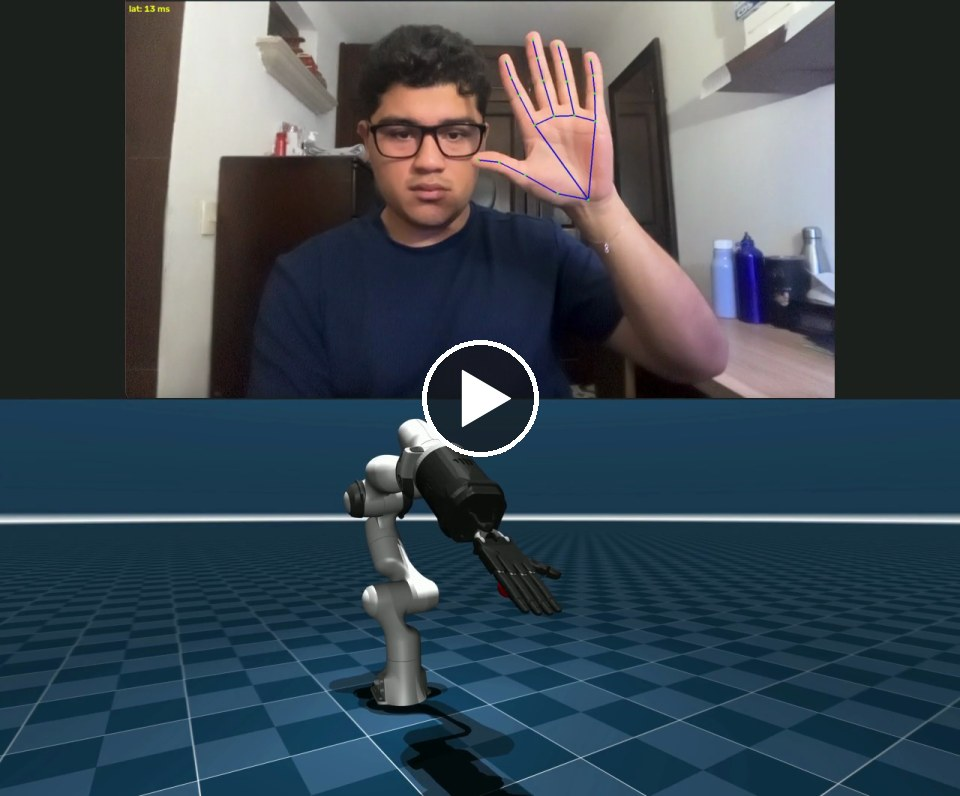
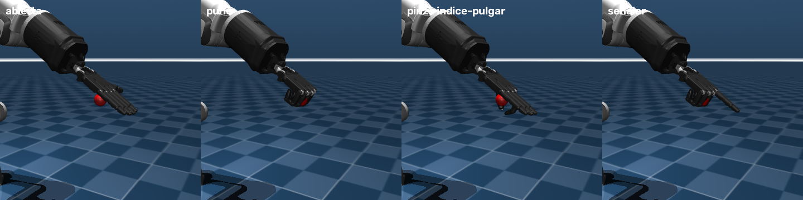
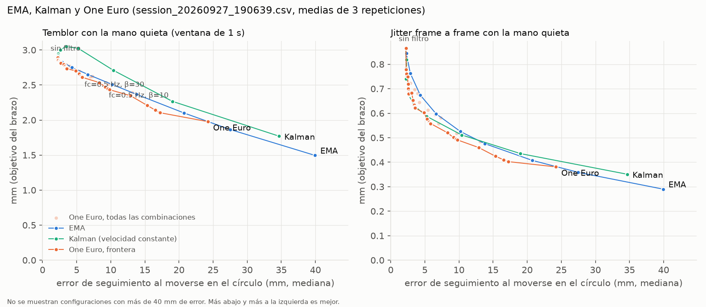

# hand-teleop-sim

Teleoperating simulated robot arms in MuJoCo with a webcam hand tracker, and a small controlled
experiment on which smoothing filter gives the best trade-off between tremor and responsiveness.

[](results/demo.mp4)

*Demo, 18 s (click to open the video): the webcam with the MediaPipe landmarks on top, and the simulated
Franka Panda with a Shadow Hand below, following the hand and copying open hand, fist, pinch and pointing.*

This is an applied project, not published research: one operator, one camera, two recorded sessions
of three repetitions each. The numbers below describe this setup and are not tested for statistical
significance.

## Question

MediaPipe hand landmarks jitter, and a robot arm driven by them inherits that jitter. Smoothing the
signal removes tremor but makes the arm lag behind the hand. **Which filter gives the best balance
between a steady arm when the hand is still and accurate tracking when the hand moves?**

Compared: no filter, an exponential moving average (EMA), the
[One Euro filter](https://gery.casiez.net/1euro/) (Casiez, Roussel and Vogel, CHI 2012) and a
constant-velocity Kalman filter.

## Short answer

On a test session recorded after the filter configurations were fixed:

- **One Euro** removed the most tremor at similar tracking error: on average 23% and 31% at the
  two operating points, versus 10% and 16% for the EMA, while tracking the circle slightly better
  than the EMA (5.6 against 6.7 mm, and 9.2 against 10.2 mm). It beat the EMA in 2 of 3 test repetitions
  (5 of 6 counting the tuning session). Its cost: after a fast movement it took about 400 ms longer
  than the EMA to catch up with the hand, because it smooths heavily again as the hand slows down.
- **EMA** is predictable but offers a single fixed trade-off.
- **The constant-velocity Kalman filter** barely reduced tremor (+2% and −10%) and overshot the
  hand by 25 to 28 mm when it stopped. Its model reads the slow 1 to 3 Hz wobble of a "still" hand
  as motion, and its frequency response amplifies that band by up to 20%.

## System

```
webcam ──> MediaPipe HandLandmarker (CPU, ~8 ms) ──UDP JSON──> mapping ──> filter ──> IK ──> MuJoCo
           handDetector.py                                      armSim.py (3-DoF arm, used in the experiment)
                                                                pandaSim.py (Franka Panda + Shadow Hand demo)
```

- **Hand signal** (`handDetector.py`): palm position in the image, a depth proxy, the thumb-index
  pinch, and the bend of every finger joint, sent over UDP about 30 times per second.
- **Depth from a single camera.** The first proxy, the wrist-to-palm length in the image, confused
  tilting the hand with moving it: tilting it at a fixed 45 cm spread the depth estimate over a
  ~39 cm range (5th to 95th percentile). `palm_max` divides each palm segment's image length by its
  metric length from MediaPipe's world landmarks and keeps the least foreshortened one, which cut
  that range to ~9 cm (`tools/depth_probe.py`).
- **Experiment arm** (`armSim.py`): a custom 3-DoF arm with damped least-squares IK. Step limiting
  and a reach clamp were added after the IK exploded near the fully stretched singularity.
- **Demo arm** (`pandaSim.py`): the Franka Emika Panda from
  [MuJoCo Menagerie](https://github.com/google-deepmind/mujoco_menagerie) with the Shadow Hand E3M5
  mounted on its flange. A 6-DoF IK keeps the palm pointing forward and 35° down, the redundant joint
  stays near a preferred posture, and each robot finger joint copies the bend of the matching human
  joint. `--hand gripper` uses the Panda gripper instead, closed by pinching.



## Method

**Record once, replay offline.** A person cannot repeat a movement exactly, so live comparisons mix
filter differences with differences between takes. `tools/record_session.py` records raw landmarks
while an on-screen guide leads the operator through the protocol, and `tools/replay.py` feeds the
same recording through every filter and the simulated arm at 500 Hz, with each frame arriving at its
capture time plus the recorded inference latency.

**Protocol**, three repetitions of four phases, each with a preparation window and 10 s recorded:

| Phase | What the operator does | Measures |
|---|---|---|
| Still | hold the open palm on a dot at ~45 cm | tremor, jitter |
| Circle | follow a dot around a circle (5 s per turn) | tracking error, lag |
| Depth | move closer and farther, matching a ring | depth tracking error |
| Jumps | the dot jumps every 2.5 s; move and hold | catch-up time, overshoot |

**Metrics**

- **Tremor**: standard deviation of the arm target during the still phase after subtracting a 1 s
  moving average, skipping the first 3 s. The raw standard deviation mostly measured how still the
  operator was, and no filter should remove slow intentional drift.
- **Jitter**: frame-to-frame variation during the still phase.
- **Tracking error**: distance from the arm tip to the unfiltered target on the circle.
- **Lag**: shift that best aligns the filtered target with the raw one, with sub-frame interpolation
  (it matches the EMA's theoretical frequency response within 1 ms).
- **Catch-up and overshoot** on jumps: time until the tip stays within 5 mm of the hand, and how far
  it gets ahead of the hand along the jump.

**Comparing filters.** Each filter was swept over its parameters. Filters are compared at equal
tracking error rather than equal lag, because the Kalman filter overshoots and distorts instead of
simply delaying, so its lag alone understates its cost.

**Tuning and test sessions.** Parameters were chosen on a tuning session (24 September 2026) and
committed as `FINAL_CONFIGS` in `tools/replay.py` (commit `8528057`) before the test session was
recorded on 27 September 2026. The acceptance rule, also set before recording, was at least 250
frames in every phase (the test session had 298 or 299). All test repetitions are reported.

## Results

Test session, mean over three repetitions. Tremor change is paired: each repetition against itself
without a filter, with the range across repetitions.

| Point | Filter | Tremor change | Jitter (mm) | Circle error (mm) | Catch-up (ms) | Overshoot (mm) |
|---|---|---|---|---|---|---|
| | No filter | 0% | 0.87 | 2.2 | 1200 | 4.0 |
| Fast | EMA, τ = 50 ms | −10% (−7 to −13) | 0.60 | 6.7 | 1160 | 2.6 |
| Fast | One Euro, fc = 0.5 Hz, β = 30 | **−23% (−2 to −41)** | 0.58 | 5.6 | 1566 | 4.3 |
| Fast | Kalman, a = 0.05 m/s² | +2% (+7 to −3) | 0.60 | 5.2 | 1389 | 24.9 |
| Smooth | EMA, τ = 75 ms | −16% (−11 to −20) | 0.53 | 10.2 | 1193 | 3.1 |
| Smooth | One Euro, fc = 0.5 Hz, β = 10 | **−31% (−6 to −51)** | 0.52 | 9.2 | 1621 | 4.7 |
| Smooth | Kalman, a = 0.02 m/s² | −10% (−3 to −19) | 0.53 | 10.4 | 1729 | 28.4 |



*Test session sweep. The curves average absolute tremor over the three repetitions, which repetition 2
dominates (see below), so the gaps between filters look smaller here than in the paired comparison.
The same chart for the tuning session is `results/sweep_tuning_session.png`.*

- In the tuning session One Euro beat the EMA in all three repetitions (−36% against −13% at the
  fast point). In the test session it won in repetitions 1 and 3 (−27% and −41% against −11% and
  −13%) and lost narrowly in repetition 2 (−2% against −7%). In that repetition the operator's depth
  estimate moved by about 9 cm during the last 2 s of the still phase, likely from moving or tilting
  the hand early. One Euro is designed to let fast motion through, so it passed that movement
  while the EMA trimmed it slightly.
- That repetition also dominates the absolute tremor (7.2 mm without a filter, against 1.0 and
  0.7 mm in the other two), which is why the paired change is the headline metric.
- Without a filter the arm overshoots slightly during fast jumps (4.0 mm), most likely because each
  30 Hz target step kicks its servo. Light smoothing reduces that (2.6 mm with the fast EMA), which
  would explain why the fast EMA catches up slightly sooner than no filter.
- End-to-end latency from the capture timestamp to the simulated tip was 20 ms without a filter:
  8 ms of hand-tracking inference and 12 ms of arm dynamics.

Full tables: `results/final_test_session.txt`, `results/final_tuning_session.txt` and
`results/paired_by_repetition.txt`.

## Limitations

- One operator, one camera and lighting setup, two sessions of three repetitions. No statistical
  testing.
- The tremor metric mixes the operator's physiological tremor with MediaPipe noise. A static
  reference (for example a fixed artificial hand) would separate them and was not recorded.
- Latency is measured from the capture timestamp, so camera exposure and USB transfer are not
  included.
- The depth proxy still spreads over a ~9 cm range when the hand tilts, and its calibration
  (`DEPTH_K`) is specific to this operator's hand and camera.
- The experiment arm is a simple simulated 3-DoF arm with gravity disabled, and targets arrive in
  30 Hz steps without interpolation. Tracking error and catch-up depend on the arm.
- Only one Kalman model was tested (constant velocity, fixed noise). Other models or adaptive noise
  may behave differently.
- The Shadow Hand mapping copies joint angles; it does not retarget fingertip positions. Its
  open-hand offsets come from the author's recordings. The demo disables contacts, so it does not
  grasp objects.

## Possible applications

The same chain from camera to robot applies wherever a person has to guide a machine without
touching it.

- **Industrial teleoperation of heavy or hot loads.** An operator away from a furnace or a heavy part
  moves a hand in front of a camera and an industrial arm repeats the motion. Beyond this project it
  would need emergency stops and forbidden zones, end-to-end latency measured on real hardware,
  motion scaling and force feedback.
- **Prosthetics.** A prosthesis cannot read the missing hand; its control usually comes from muscle
  signals. Vision can still help, by recognizing the object to pre-shape the grasp or by letting the
  healthy hand demonstrate a gesture that the prosthesis mirrors. The joint-to-joint finger mapping
  and the simulated dexterous hand here are a starting point for that kind of prototyping.
- **Therapy games.** A patient with limited hand mobility completes goals such as grasping a cube,
  drawing circles or closing one finger, and the game tracks progress between sessions. The guided
  protocol, the per-finger angles and the tremor, accuracy and catch-up metrics already exist here,
  and only landmarks are stored, not video. It would need to be designed with therapists, calibrated
  to each patient's range of motion and clinically validated.
- **Others:** collecting demonstrations to teach robots by imitation, working in hazardous or remote
  places, and teaching teleoperation without buying hardware.

## Related work

These ideas already have serious precedents. This project is a minimal version of the field: an
ordinary webcam instead of gloves or suits, and an explicit measurement of the trade-off between
tremor and lag.

| System | What it does | Relation to this project |
|---|---|---|
| [DexPilot](https://arxiv.org/abs/1910.03135) (NVIDIA, 2019) | Controls a 23-actuator robot arm and hand with cameras by observing the operator's bare hand | Same idea, on a real robot and fine manipulation tasks |
| [AnyTeleop](https://arxiv.org/abs/2307.04577) (UC San Diego and NVIDIA, RSS 2023) | Vision-based teleoperation for many arms, dexterous hands, cameras and simulators, used to collect data for imitation learning | The closest: cameras, dexterous hands and simulation, built to generalize across robots |
| [Shadow Teleoperation System](https://shadowrobot.com/teleoperation/) (Shadow Robot) | A glove drives the Shadow Dexterous Hand; with the HaptX glove the operator feels pressure, temperature and vibration. For nuclear, pharmaceutical and maintenance work | The same hand as the demo, driven by sensor gloves with touch feedback instead of a camera |
| [Sarcos Guardian XT](https://www.robotics247.com/article/sarcos_robotics_successfully_implements_teleoperation_capabilities_of_guardian_xt_robotic_system) (announced 2021) | Teleoperated robot that lifts up to 90 kg; the operator wears a motion-capture suit, a VR headset and force feedback | The industrial use case, with a suit and force feedback instead of a camera |
| [A hand that sees](https://www.ncl.ac.uk/press/articles/archive/2017/05/handthatsees/) (Newcastle University, 2017) | Prosthetic hand with a camera that recognizes an object's shape and picks one of four grasps | The prosthetic use case: vision chooses the grasp, but the camera looks at the object, not the user's hand |
| [Leap Motion for rehabilitation](https://pmc.ncbi.nlm.nih.gov/articles/PMC12103098/) (IEEE TNSRE, 2024) | Measured camera-based hand-tracking accuracy with 10 people with upper-body disabilities and 7 without; accuracy did not differ between groups | The therapy use case, with a specialized infrared camera and assessment rather than a game |

## Reproduce

Tested with Python 3.12 on macOS (Apple Silicon).

```bash
pip install -r requirements.txt
```

`mediapipe` is pinned to 0.10.35: version 1.0.x aborts on macOS with the CPU delegate. On macOS the
MuJoCo viewer requires `mjpython`, and the scripts that use the camera need camera permission for the
app that runs them.

The recordings behind every number are in `recordings/` (landmarks only, no video; see
`recordings/README.md`). To reproduce the results tables and the sweep chart:

```bash
python tools/replay.py recordings/session_20260927_190639.csv --final   # test session table
python tools/replay.py recordings/session_20260924_214146.csv --final   # tuning session table
python tools/replay.py recordings/session_20260927_190639.csv --sweep --plot sweep.png
```

To record a new session (guided, about 3 minutes, saved to `data/`):

```bash
python tools/record_session.py
```

Live, start the simulator first and then the detector:

```bash
mjpython pandaSim.py --filter oneeuro          # Panda with the Shadow Hand
mjpython armSim.py --filter oneeuro            # experiment arm
python handDetector.py
```

## Repository layout

```
handDetector.py         camera, MediaPipe and the UDP message
armSim.py               3-DoF experiment arm, mapping and IK
pandaSim.py             Franka Panda demo with the Shadow Hand or the gripper
filters.py              NoFilter, EMA, One Euro, Kalman with a common update(z, t) interface
tools/record_session.py guided recording protocol
tools/replay.py         offline replay, metrics, sweeps, plots and the fixed final configurations
tools/depth_probe.py    depth-proxy comparison recorder
results/                tables, figures and the demo video cited above
recordings/             raw landmark recordings behind every result
models/                 unmodified MuJoCo Menagerie models (Apache 2.0), see models/README.md
```

## How this was built

Developed with an AI coding assistant (Claude Code), which wrote most of the code and proposed parts
of the method, such as the record-and-replay evaluation and comparing filters at equal tracking
error. The research question, the choice between the options at each step and all the recordings
are my own.

## Credits

Robot models from [MuJoCo Menagerie](https://github.com/google-deepmind/mujoco_menagerie) (Google
DeepMind, Franka Emika and Shadow Robot Company, Apache 2.0). Hand tracking by
[MediaPipe](https://ai.google.dev/edge/mediapipe). Simulation with [MuJoCo](https://mujoco.org).
One Euro filter: G. Casiez, N. Roussel and D. Vogel,
["1€ Filter: A Simple Speed-based Low-pass Filter for Noisy Input in Interactive Systems"](https://dl.acm.org/doi/10.1145/2207676.2208639),
CHI 2012 ([official page](https://gery.casiez.net/1euro/)).
